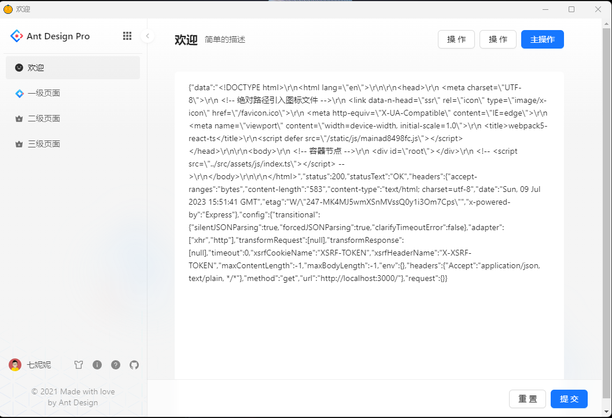

使用webpack5+react+ts+antdsign pro + electron 搭建客户端的后台管理系统模板

1. 路由配置
 - `https://blog.csdn.net/weixin_45667289/article/details/128464423`

2. 先用`npm run dev`启动react项目，在新的终端窗口执行`electron .`后客户端自动打开，内容是react项目中的内容

3. 打包前先执行一下命令
- `npm install --save-dev @electron-forge/cli`
- `npx electron-forge import`

4. 界面展示图：

